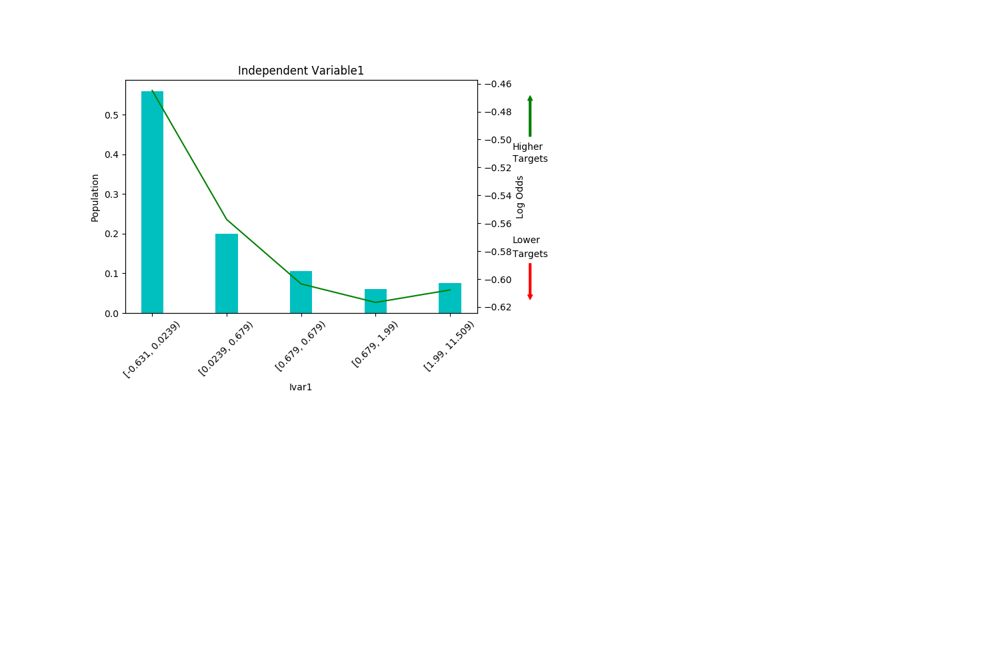

# Target-Variable Bivariate Relationship

This repository is used for visual exploration of target independent variable relationship. For each variable, below visualisations are plotted:
- The histogram of independent variable
- Log odds of target vs independent variable

Independent variables are processed as below:
- Numerical Variables: Create bins. Default 10 bins. For customer number of bins, use parameter numeric_bins
- Categorical Variables: Group low occuring values. Each value occuring <5% is grouped to others. For customer threshold, use parameter categorical_threshold

### Usage 
> plot_exploratory_charts.py [-h] [--ifile IFILE] [--d D] [--target TARGET] [--invars INVARS] [--numeric_bins NUMERIC_BINS] [--categorical_threshold CATEGORICAL_THRESHOLD] [--output_csv OUTPUT_CSV]

### Arguments
  --ifile                   Input file
  --d                       Delimiter. Default: Comma
  --target                  Dependent Variable. Default: target
  --invars                  File with independent variables
  --numeric_bins            Bins for numerical variables. Defualt: 10
  --categorical_threshold   Threshold below which categorical values grouped to others. Defualt: 0.05
  --output_csv              Path for output summary csv. If not given, no csv output saved

  
### Example  
> python plot_exploratory_charts.py --ifile train.csv --invars vars.txt --target my_target

> python plot_exploratory_charts.py --ifile train.csv --invars vars.txt --target my_target -d \| --numeric_bins 20 --categorical_threshold 0.01 --output_csv bivariate_summary.csv

### Sample Plot

